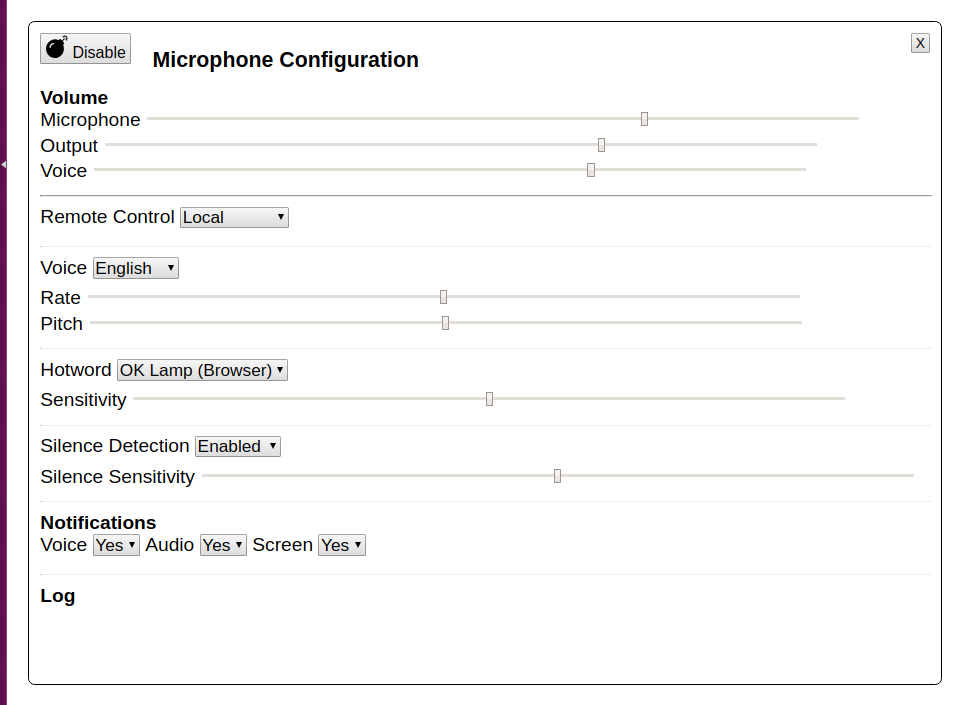

# OpenSnips


## Overview

This project is home to a number of open source projects related to the Snips voice platform.

- <b>[snips-webbrowser-audioserver](./snips-webbrowser-audioserver/README.md) </b> - React component (and vanillajs lib) to add a microphone button to a web page that streams mqtt audio to Snips. Implements hotword,audioserver and tts components of the Snips mqtt hermes protocol.
- <b>snips-scripts</b>  - alternative python based 100% open source  implementations of all elements of the [Hermes MQTT protocol](https://github.com/snipsco/snips-platform-documentation/wiki/6.--Miscellaneous#hermes-protocol) used by Snips.
- <b>multi architecture (arm/i386) docker images</b> for 
    - snips
    - pulseaudio
    - nodejs
    - python with rasa
- <b>example docker-compose.yml configuration suites</b> making it easy to run snips with mqtt components from multiple platforms.


## Quickstart

Install docker
```
curl -fsSL https://get.docker.com -o get-docker.sh
$ sudo sh get-docker.sh
apt-get install docker-compose
```

Run the example
```
git clone https://github.com/syntithenai/opensnips.git
docker-compose up &

```
Open http://localhost:3000/ in your browser to see the microphone demo.


## Web Browser Audioserver





## Snips Scripts Features


The repository developed to allow running the Hermes protocol on a Linux laptop or server. Most of the services will work fine on a Raspberry Pi but some hacks(temporary swap file) are required for building some services.

By using RASA core as the basis of a replacement for the Snips Skills server, it is possible to use machine learning to control the flow of conversation and develop extended interactions that go beyond confirmations and form wizards.

By using RASA NLU and Kaldi ASR, it is possible to build training pipelines locally so that changing ASR and/or NLU models is as easy as saving a file. Kaldi also provides a distinct websockets interface that can be used from Android with [Konele](http://kaljurand.github.io/K6nele/about/).

The opensnips hotword service is extended to use piwho to identify the speaker from their voice (ack [Greg](https://github.com/oziee/hotword) ). [Piwho is not working at the moment but the hotword service for snowboy is otherwise fine.]


<br><br>
Note that the official Snips services are highly optimised to perform with large data sets on minimum hardware and includes quality software with error checking, logging and testing and is suitable for commercial deployments.

This repository is intended for developers who want to hack on Snips.

__Many thanks to the teams at Snips, RASA and Kaldi for their ongoing contribution to realising the future of talking to our tech. Namaste.__


<br>

__The repository includes:__

- Dockerfiles to build 
    - an multi architecture image based on Debian Jessie or Raspbian Stretch supporting the installation of Snips.
    - a multi architecture image supporting installation of RASA, Kaldi, Snowboy.
    - a Kaldi image that incorporates the English language models.
    
- Python scripts implementing snips MQTT services (docker-images/rasa/snips_services/*)
    - audioserver
    - tts
    - hotword
    - asr (using Kaldi)
    - nlu (using RASA)
    - dialog
    - actionhandler (snips skills manager) (using RASA core)
    
- docker-compose.yml file to start a suite including 
    - all services required for hermes in both opensnips and official snips versions.
    - examples for the audio server using sound devices directly or pulseaudio server on the host
    - configuration for all services as environment variables
 
### Configuration
See docker-compose.yml in the root of the project for configuration options.


## Architecture/Platform Support

The Dockerfiles build on x86_64(Linux desktop/server) and arm (Raspberry pi).

Support for pulseaudio on raspberry pi/arm is pending but mostly there.

It is apparently possible to install pulseaudio on MS Windows and MacOSX which should allow the suite to be used with Docker on other platforms than Linux.


## Services

The open snips services are intended to be compatible with the official snips services.
[For more detail about the Hermes protocol ](https://github.com/snipsco/snips-platform-documentation/wiki/6.--Miscellaneous#hermes-protocol)

In general open snips services are configured using environment variables defined in the docker-compose file.

### Audio Server

The default setup assumes that there is an external microphone available to ALSA on hw:1,0.
See docker-compose.yml and docker-images/rasa/snips-services/asound*.conf for variations in sound setup corresponding to which audioserver is used and how.

The audio server sends and recieves audio data over MQTT.
The server sends a constant stream of messages to subscribed clients, 256 samples long frames, signed 16bit, mono, 16000Hz each frame in its own .wav container.

The server can receive and play audio samples of arbitrary length in the same format.
    
At this time, a bug in the audio server is negatively but not terminally affecting hotword and speech recognition so the official server is enabled by default.


### Hotword Server

The hotword server listens to the audio server and fires hermes/hotword/detected when it hears the hotword.

The default hotword for opensnips is  "snowboy" 

Snowboy is used for detection. Create a model file at [https://snowboy.kitt.ai/](https://snowboy.kitt.ai/)

The docker-compose file contains environment variables to configure snowboy including 

```
    environment:
        - hotword_model=/opt/snips_hotword_snowboy/resources/snowboy.umdl
        - hotword=snowboy
        - hotword_sensitivity=0.5
        
```


Inside piwho/data a folder structure can be created containing speaker identification training data.
eg
- data
    - steve
        - wav1.wav
    - tara
        - wav1.wav
        - wav2.wav

There must be at least two different users/folders with wav files.

The hotword server watches for changes to training data and rebuilds the MARF database file and speakers.txt file when the training data changes.

If the identification has trained successfully, the hotword server will send 


### Dialogue Server

The dialogue server is the glue that listens to other services and sends messages to trigger the next step of recognition.

The opensnips dialogue server implements most of the features of the official version.

A snips model downloaded from http://console.snips.ai is required to run the official dialogue component (as well as the nlu and or asr components).

The opensnips dialogue server does not take any models into consideration.

At this time, the following features are pending.

- hermes/dialogueManager/continueSession
- hermes/nlu/partialQuery
- hermes/nlu/slotParsed
- hermes/asr/partialTextCaptured


### Automated Speech Recognition (ASR)

ASR is implemented using two containers

- the [Kaldi GStreamer Server](https://github.com/jcsilva/docker-kaldi-gstreamer-server) 
- a server script to listen to kaldi and send MQTT messages

The Kaldi image comes with the nnet2 models for English

Alternative ASR models can be installed by host mounting them into /opt/models and creating a configuration file (see nnet2.yaml)

An additional container named dictate showcases using the ASR from a web page.

At this time, the opensnips ASR service has not been adapted for arm on raspberry pi :(   
   
    
### Natural Language Understanding (NLU)

NLU is implemented using RASA.AI. A single python script handles both NLU requests and action handler requests (see below)
Configuration allows disabling either NLU or action handler.

RASA models are generated based on the nlu training file and the core training or domain file. The server watches changes on these files and regenerates the models when the training files are saved.

Snips user id is used to exclude the user id when processing intent names.

    #- disable_nlu=no|yes
    # disable_core=yes
    #- mqtt_hostname=mosquitto
    #- mqtt_port=1883
    #- nlu_model_path=models/nlu
    #- snips_assistant_path=models/snips
    #- snips_user_id=user_Kr5A7b4OD
    #- core_model_path=models/dialogue
    #- config_file=config/config.json
    #- domain_file=config/domain.yml
    #- nlu_training_file=config/nlu.md
    #- core_training_file=config/stories.md
    #- lang=en-GB

This repository comes with models for [Meeka Music](https://meekamusic.com). Try saying "play some pop music" or "play the next track".   The repository also includes an example snips assistant model with an identical vocabulary 

### Text to Speech (TTS)

The text to speech server responds to MQQT message hermes/tts/say by using pico2wave to convert the text into a sound file and playing it.


### Action Handler

The action handler replaces the snips skills server. It listens for hermes/intent/XXXX and triggers appropriate actions.

Determining the next action to take given the current intent and slots is done using RASA core.

Where the action is only required to reply, templates from the RASA domain model can be used. Where action are required to do more, the [RASA format can refer to python class files](https://core.rasa.ai/stories.html). 

As described in the NLU section above. Changes to the training files will trigger retraining of the model files.


## Snips

The docker compose suite lays out alternatives for each service from either open snips or official snips.
By default the suite runs the opensnips versions of services. To swap a given service out for the official one, comment the opensnips version and uncomment the official version.

The generic asr model is built into the snips image. To override it, use docker-compose to mount a host volume containing a different model.

The image comes with a music player assistant as an example. Currently the snips assistant can be overridden by volume mount in docker-compose. In the future, the snips assistant files will be generated based on rasa stories.

Similarly the config file is a volume mount.

```
volumes:
            # generic model is built into image, override with other models here
            #- /home/stever/projects/snips-asr-model-en-500MB/snips-asr-model-en-500MB:/usr/share/snips/assistant/custom_asr
            # snips config
            - ./docker-compose/snips/config/assistant:/usr/share/snips/assistant
            - ./docker-compose/snips/snips.toml:/etc/snips.toml
```    


## Build

- ```docker-compose build <service key from docker-compose>```

-----------------------------------------------

- To build rasa on a raspberry pi you will need some swap memory. DO NOT LEAVE THIS ENABLED OR YOU WILL KILL YOUR SD CARD.

```

dd if=/dev/zero of=/swapfile bs=1M count=1024 # For 1GB swap file

mkswap /swapfile

swapon /swapfile

docker-compose build <service key>

```

__when finished be sure to      swapoff /swapfile; rm /swapfile__


    
## Roadmap

My goal is to better understand what is possible in conversational UI by developing a user interface that
brings together RASA story telling format and snips skills.

My previous experience develop a voice first music player using dialogflow was very command like. For speech interactions to be widely accepted, recognition needs to be much more flexible and forgiving. I'm hopeful that RASA core will provide that flexibility.

As a starting point a minimal text format.

- Many stories serve as the training data of what actions to take based on what intents are triggered.
- Each story starts with ##
- An interaction starts with a * and the name of the intent.
- Example sentences preceded by = follow (used to generate NLU config)
- Actions sentences preceded by - by default return the text and where the text starts with an _ are executed (snips skills)


With the story format, confirmations, Yes/No responses, form wizard (slot filling) stories and more are possible.


### For example
```

## play some music
* play music
  = gimme some tunes
  = play some music
  - ok playing some random music
  - _play_music
  

## play some jazz music
* play music [genre=pop]
  = i want to hear some pop music
  = play some pop music
  - ok playing some pop music
  - _play_music

## play music by artist
* play music [artist=Josh Woodward]
  = i want to hear something by Josh Woodward
  = play some music by Josh Woodward
  - ok playing some music by Josh Woodward
  - _play_music

## clear the playlist
* clear the playlist
  - do you really want to clear the playlist?
* agree
  - ok clearing the playlist
  - _clearplaylist

```


# Links

##  browser microphone
https://github.com/gabrielpoca/browser-pcm-stream - BASE
https://github.com/chris-rudmin/opus-recorder  
https://www.npmjs.com/package/wavefile

### resample wav to 16000
https://stackoverflow.com/questions/36525264/convert-sample-rate-in-web-audio-api
https://stackoverflow.com/questions/28821124/how-to-set-up-sample-rate-using-web-audio-api/31366337#31366337
NPM ONLY https://github.com/notthetup/resampler


READ ME STEVE
https://snips-nlu.readthedocs.io/en/latest/tutorial.html


## DeepSpeech
https://github.com/mozilla/DeepSpeech
https://hub.docker.com/r/voidspacexyz/deepspeech/builds/
https://tools.taskcluster.net/index/artifacts/project.deepspeech.tensorflow.pip.cpu/08894f64fc67b7a8031fc68cb838a27009c3e6e6


### Kaldi
- https://github.com/alumae/kaldi-gstreamer-server
- https://hub.docker.com/r/jcsilva/docker-kaldi-gstreamer-server/
- or 
- https://github.com/hipstas/kaldi-pop-up-archive
- https://github.com/achernetsov/kaldi-docker-example
- https://github.com/alumae/gst-kaldi-nnet2-online

https://chrisearch.wordpress.com/2017/03/11/speech-recognition-using-kaldi-extending-and-using-the-aspire-model/


!!! one shot embedded model
https://github.com/jcsilva/docker-kaldi-gstreamer-server/issues/8

!!! aspire model
https://github.com/jcsilva/docker-kaldi-gstreamer-server/issues/15

#### Client

- http://kaljurand.github.io/K6nele/about/

- https://github.com/Kaljurand/dictate.js


## Alternative Suite
http://alex.readthedocs.io/en/master/index.html
https://github.com/UFAL-DSG

https://n0where.net/free-open-source-siri-project-sirius/
https://github.com/claritylab/lucida


## Reading
http://www.nltk.org/book/


## Language Generation
https://github.com/simplenlg/simplenlg/wiki/Section-I-%E2%80%93-What-is-SimpleNLG

https://github.com/SteGriff/Paprika

https://github.com/spro/nalgene

https://github.com/jeremyfromearth/metonym

## Corpus
http://www.openslr.org/12


    
### WIP    
- skills server using RASA core and story format described below to listen for hermes/nlu/intentParsed and take actions based on stories.
- web server with site for editing stories to generate rasa_nlu, rasa_core and snips stubs from a story.


### Protocol Description

The Hermes protocol is designed to allow a suite of services to implement spoken conversational dialogue 


By splitting the stages of speech recognition into distinct services

- services can be swapped out for alternatives eg rasa dialogflow or snips NLU
- services are encouraged to be encapsulated knowing as little about other services as possible.
- some services (eg training) can distributed to higher power devices on the network

In general the services should

- minimise what they know about each other to a public api.
- be known by as few other services as possible

#### Service Interactions

audioserver is used by 
    - hotword   (hermes/audioserver/+/audioFrame)
    - asr
    - tts   (hermes/audioserver/playBytes)

dialog server uses all services except the audioserver

actionhandler interacts with dialog server via 
IN
- intent
OUT
- sessionStart 
- continueSession

#### Description

The audio streamer continuously streams audio frames to the hotword server. It also acts on messages to play audio frames.

1. hermes/hotword/detected?siteId=default

When a hotword is detected a message is sent that triggers the dialogue manager to stop the hotword, and start the ASR.
The hotword detected message includes a siteId that is saved by the dialogue manager in a dict against the sessionId.

A sessionId is generated by the dialogue manager when the hotword is detected.
It is used to track the dialogue session as it progresses through the various services.

2. hermes/asr/textCaptured?sessionId

The dialog manager is responsible for managing the flow of speech input and output across the services.
The default flow is hotword,asr,nlu,handler.

Dialogue manager could be extended to 
- support flows including choosing from a list of intents or filling the value for a slot from predefined or free text values.
- support selection of loaded asr or nlu models.

In the current version, 
- sessionId is passed universally
at times 
- siteId
- hotwordId


hermes/hotword/default/detected
OR
hermes/dialogue/startSession
- siteId
- customData
- {'type':'action|notification','text':''}


hermes/dialogue/continueSession
- text
- intentFilter
extra params
- slot
- model
- capture = true/false


### Protocol Reference

audioserver
- hermes/audioserver/playFrames
- hermes/audioserver/audioFrame

hotword
- hermes/hotword/<hotwordid>/toggleOn?siteId
- hermes/hotword/<hotwordid>/toggleOn?siteId
- hermes/hotword/<hotwordid>/detected?siteId

asr
- hermes/asr/startListening?siteId
- hermes/asr/stopListening?siteId
    - hermes/asr/partialTextCaptured?text=?siteId
    - hermes/asr/textCaptured?text=?siteId
    
nlu
- hermes/nlu/query?input?intentFilter?slot?model?fallback
    - hermes/nlu/intentParsed
- hermes/nlu/partialQuery?input?intentName?slotName?model
    - hermes/nlu/slotParsed
 

tts
- hermes/tts/say

dialog
- hotword/detected
    - asr/stopListening
    - hotword/toggleOff
    - asr/startListening
    
- asr/textCaptured
    - nlu/query

- nlu/intentParsed
    - hermes/intent
    
- nlu/slotParsed
    - hermes/intent
    
actionhandler
- hermes/intent
- hermes/dialogue/startSession
- hermes/dialogue/continueSession


EXTENSION
# distributed training
- hermes/training/start?trainingData?type=rasa_nlu,rasa_core,kaldi,snips
    - hermes/training/complete?trainingResults
- hermes/training/missingModel?modelName?type
    - hermes/training/start?trainingData

# dialog shortcuts
hermes/dialogue/say
hermes/dialogue/ask
hermes/dialogue/ask_slot
hermes/dialogue/capture_slot
    
  
# TODO
- foreach server
  - python style - functions _, classNames titleCase, 
  - comments pylint
  - constructor parameters and env vars consistency, remove some defaults replace with settings in docker-compose.yml
  - remove snips references
  


[](snips-webbrowser-audioserver/README.md) [audioserver](./snips-webbrowser-audioserver/README.md) 