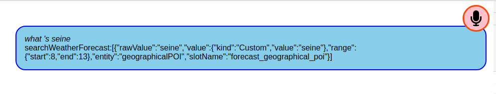

# snips-react-satellite

React component providing a microphone that works with [Snips](http://snips.ai).
Implements audioserver,hotword,tts and skill-server elements of the Hermes protocol.


## TODO

- restore config panel
- wait for sayFinished before end session after intent
- remove hack for initialising dialogueManager start/stop session
- eventFunctions rename # to +
- tighten subscriptions to eventFunction keys.
- android not working ?
- force endSession on silence timeout with hark (in case snips doesn't respond)

## Wishlist

- expand example
    - query to site mapping
    - alarm
    - note taking
    - maths
    - volume
    - audio notes
    
- speech bubble style

## Questions

- Currently the microphone component does a little dance when it loads to force Snips to listen.
    - start session
    - wait for session to start plus half a second while audio streams then end session.
    
Without this "initialisation", the snips dialog manager will start a session, send the blip sounds and send asr/startListening on the browser site but never sends textCaptured or stopListening.

This first session is visible in the demo log view.


- ?? scalable use for a website would require the possibility for clients to subscribe to based on their userId.
To implement this would require that some services in the Hermes protocol suite to optionally support the userId in the topic string.


## About

This package provides a React component that shows a microphone and streams audio over mqtt in a dialog suitable for the [Snips Voice Platform](https://snips.ai) making it easy to develop web applications that behave as satellites in the Snips ecosystem.

- The package only makes sense when used with a Snips voice server.

- !! Note that the mqtt server must support web sockets for a web browser to talk directly.

There are no settings in the snips mqtt server for websockets so an external broker may be required.
See the docker files for websocket configuration of mosquitto.


## Features

- implements audioserver elements of the Snips hermes mqtt protocol supporting streaming audio to and from the device.

- optionally implements the hotword server elements of the Snips hermes mqtt protocol using Porcupine running with WebAssembly in the browser. Currently the only available hotword is "Ok Lamp" (or a range of colors). 

I've requested snips and mycroft [here](https://github.com/Picovoice/Porcupine/issues/95)

- implements the tts  server elements of the Snips hermes mqtt protocol using native voices or falling back to speak.js javascript tts generation.

By default the first voice from speechSynthesis.getVoices() is used or if no voices are available falls back to speak.js to generate audio.

Preferred voice can be set in the configuration panel.

- long press or right click to show configuration page to select volume, tts voice, hotword, remote control and silence detection.

- logs showing asr transcripts, intent and tts plus audio recordings for each asr transcript.


## Screenshots




## Quickstart

!! Ensure the snips voice services are running on localhost

Run the example

```
git clone https://github.com/syntithenai/opensnips.git
cd snips-react-satellite
npm install
npm start

```

## Install

```bash
npm install --save snips-react-satellite

!! ensure global script files are included as per example

```


## Usage


At  bare minimum just include the satellite component in your layout.

```jsx
import React, { Component } from 'react'

import {SnipsReactSatellite} from 'snips-react-satellite'

class App extends Component {
  render () {
    return (
      <SnipsReactSatellite  />
      
    )
  }
}
```


By lifting the scope of the logger, it can be shared with other components.

```


export default class App extends Component {
    
    constructor(props) {
        super(props);
        this.state={}
        this.setLogData = this.setLogData.bind(this);
        this.siteId = 'browser_'+parseInt(Math.random()*100000000,10);
        this.logger = new SnipsLogger({logAudio:true,setLogData:this.setLogData });
    }
    
   setLogData() {
        this.setState( this.state );  // force update
   };
                  
  render () {
    return (
        <div>
            <SnipsReactSatellite logger={this.logger} siteId={this.siteId} intents={this.intents} />
           
             <br/><br/><br/><br/><br/><br/><br/>
             <hr/>
            <SnipsReactLogger logger={this.logger} {...this.logger.state} siteId={null}/>
            <hr/>
            <SnipsReactFlatLogger logger={this.logger} {...this.logger.state} siteId={null}/>
            
        </div>
    )
  }
}

```


Alternatively a more fine grained approach is to use individual components.
A siteId is shared across all components as is the logger instance.

Hotword and App Server are optional can be disabled by removing the component.

!! Microphone, TTS and Speaker components are necessary elements of the Snips dialog flow, without sayFinished and playFinished, the dialogueManager will pause.

In the future alternate components could be swapped in to mute audio or use network provided tts (that implement say/playFinished)

```
import {SnipsReactHotwordServer,SnipsReactMicrophone,SnipsReactTts,SnipsReactSpeaker,SnipsReactAppServer} from 'snips-react-satellite'

class App extends Component  {

    constructor(props) {
        super(props);
        this.siteId = props.siteId ? props.siteId : 'browser_'+parseInt(Math.random()*100000000,10);
        
        this.state = {config:{}}
        this.logger = props.logger ? props.logger : new SnipsLogger({logAudio:false,setLogData:this.setLogData });
    }  
    
    render() {
        let position=this.props.position ? this.props.position  : 'top left'
        return <div id ="snipsreactsatellite" >
            <SnipsReactHotwordServer toggleOn={true} logger={this.logger} siteId={this.siteId} config={this.props.config} />
            <SnipsReactMicrophone position={position} logger={this.logger} siteId={this.siteId} config={this.props.config} />
            <SnipsReactTts logger={this.logger} siteId={this.siteId}  config={this.props.config}/>
            <SnipsReactSpeaker logger={this.logger} siteId={this.siteId}  config={this.props.config}/>
            {this.props.intents && <SnipsReactAppServer logger={this.logger} intents={this.props.intents}  config={this.props.config} />}
            
        </div>
    };

  
}


```

## Components

### SnipsReactSatellite
Combination of components to implement Snips satellite.

### SnipsReactHotwordServer


### SnipsReactMicrophone


### SnipsReactTts


### SnipsReactSpeaker


### SnipsReactAppServer


## Props


- mqttServer
- mqttPort
- hotwordId
- siteId
- clientId
- buttonStyle
- speechBubbleStyle
- configStyle
- position


## Links

### silence recogniser
https://github.com/otalk/hark

### create a react module
https://github.com/transitive-bullshit/create-react-library

### hotword detector
https://github.com/Picovoice/Porcupine/tree/master/demo/js

### play audio data from mqtt
https://stackoverflow.com/questions/44073159/play-wav-file-as-bytes-received-from-server

### vumeter
https://codepen.io/travisholliday/pen/gyaJk

### media demo - using native tts voices
https://codepen.io/matt-west/pen/wGzuJ

### crunker join wav files
https://github.com/jackedgson/crunker


## License

MIT © [syntithenai](https://github.com/syntithenai)
